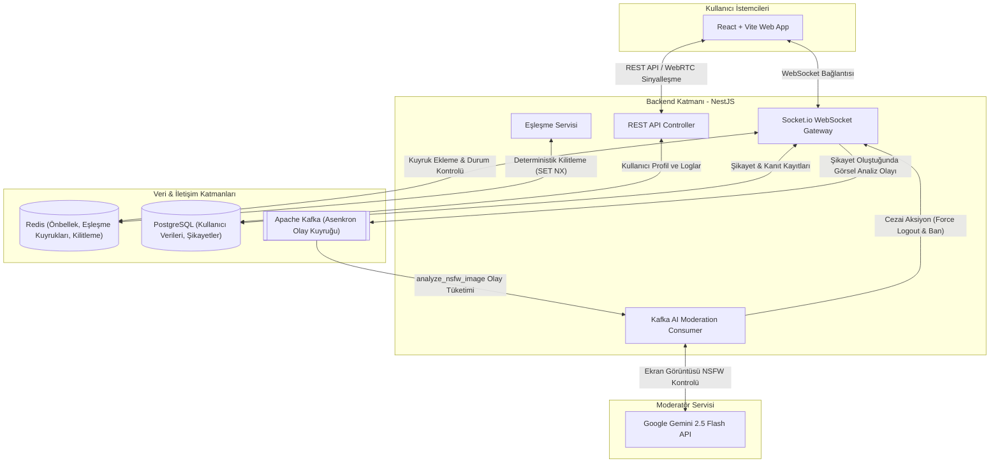

# 🚀 BahoTv - Üniversite Öğrencileri İçin Anonim Görüntülü Sohbet ve Sosyal Etkileşim Platformu

[](https://nestjs.com/)
[](https://react.dev/)
[](https://redis.io/)
[](https://kafka.apache.org/)
[](https://deepmind.google/technologies/gemini/)
[](https://www.postgresql.org/)

**BahoTv**, Sakarya Üniversitesi (SAÜ) ve Sakarya Uygulamalı Bilimler Üniversitesi (SUBÜ) öğrencilerine özel olarak tasarlanmış; e-posta doğrulama filtreli, gelişmiş yapay zeka denetimli ve tamamen anonim anlık görüntülü sohbet platformudur. 

Proje; **Web (Vite + React)** ve yüksek ölçeklenebilir **Mikroservis benzeri Modüler Monolit Backend (NestJS)** katmanlarından oluşmaktadır.

---

## 🏗️ Sistem Mimarisi ve Teknoloji Yığını

BahoTv, yüksek trafikli anlık eşleşmeleri ve asenkron iş yüklerini minimum gecikmeyle yönetmek üzere tasarlanmış modern bir mimariye sahiptir.



### 🛠️ Teknoloji Kartı
- **Backend:** NestJS, TypeScript, TypeORM, Socket.io, Kafkajs, Nodemailer.
- **Frontend (Web):** React 18, Vite 6, Tailwind CSS 4, Radix UI (Shadcn UI stili), Lucide Icons, Recharts (Admin Analitiği), Socket.io Client.
- **Altyapı & Veri:** PostgreSQL 14, Redis Alpine (ioredis), Apache Kafka 3.7.0 (KRaft modu ile zookeepersız kurulum), Docker Compose.
- **Yapay Zeka Modeli:** Google Gemini (`gemini-2.5-flash`) API.

---

## 🌟 Öne Çıkan Gelişmiş Özellikler

### 1. ⚡ Deterministik Kilitleme Destekli Akıllı Eşleşme
- **Redis Tabanlı Kuyruk:** Kullanıcılar `find_match` isteği gönderdiklerinde Redis üzerinde üniversite ve cinsiyet filtrelerine göre dinamik setlerde sıraya alınır.
- **Yarış Durumu (Race Condition) Önleme:** Redis'in `SET NX` komutu kullanılarak deterministik kilit mekanizması işletilir.
- **Hızlı Kesişim Sorgusu:** Redis'in `SINTER` ve `SRANDMEMBER` yetenekleri kullanılarak milisaniyeler içinde optimize eşleşme sağlanır.

### 2. 📹 WebRTC Peer-to-Peer Görüntülü Sohbet
- Kullanıcılar eşleştiğinde, video ve ses verileri doğrudan tarayıcıdan tarayıcıya (**P2P**) akar.
- Sunucu, yalnızca sinyalleşme (Offer, Answer, ICE Candidates) aşamasında **Socket.io** üzerinden aracı rol oynar.

### 3. 🤖 Yapay Zeka Gücüyle Otomatik Moderasyon
- **Kanıt Yakalama:** Şikayet anında otomatik ekran görüntüsü alınır.
- **Kafka Asenkron İşleme:** Görüntü analizi sistemi yavaşlatmamak için asenkron olarak kuyruğa alınır.
- **Gemini AI Analizi:** **Google Gemini 2.5 Flash** modeli görüntüyü NSFW/Çıplaklık/Şiddet açısından analiz eder.
- **Anında Ban:** İhlal durumunda kullanıcı saniyeler içinde sistemden atılır ve kara listeye alınır.

### 4. 📊 Gelişmiş Admin Dashboard & Bakım Modu
- **Canlı Analizler:** Aktif kullanıcı ve şikayet grafikleri.
- **Sistem Tahliyesi:** Bakım modunda tüm soketlere geri sayım uyarısı gönderilir ve güvenli kapanış sağlanır.

---

## 📁 Proje Dosya Yapısı

```text
BahoTv/
├── backend/                  # NestJS Sunucu Kodu
│   ├── src/
│   │   ├── common/           # Enums, Guards, Decorators
│   │   ├── modules/
│   │   │   ├── admin/        # Yönetim ve Moderasyon
│   │   │   ├── auth/         # JWT Kimlik Doğrulama
│   │   │   ├── email/        # Aktivasyon E-postaları
│   │   │   ├── socket/       # WebSocket & Matching Engine
│   │   │   └── user/         # Kullanıcı İşlemleri
│   ├── docker-compose.yml    # Altyapı Servisleri
│   └── package.json
│
└── frontend/                 # React + Vite Web Arayüzü
    ├── src/
    │   ├── admin/            # Admin Paneli
    │   ├── components/       # Ortak UI Bileşenleri
    │   ├── pages/            # Ana Sayfalar
    └── package.json
```

---

## 🚀 Kurulum Rehberi

### Gereksinimler
- [Node.js](https://nodejs.org/) (v18+)
- [Docker Desktop](https://www.docker.com/)

### Adım 1: Servisleri Başlatma
```bash
docker-compose up -d
```

### Adım 2: Backend Yapılandırması
1. `backend` dizinine gidin: `cd backend`
2. Bağımlılıkları yükleyin: `npm install`
3. `.env.example` dosyasını `.env` olarak kopyalayın ve gerekli bilgileri doldurun.
4. Başlatın: `npm run start:dev`

### Adım 3: Frontend Yapılandırması
1. `frontend` dizinine gidin: `cd frontend`
2. Bağımlılıkları yükleyin: `npm install`
3. `.env.example` dosyasını `.env` olarak kopyalayın.
4. Başlatın: `npm run dev`

---

## 🔒 Güvenlik
- **Üniversite Filtresi:** Sadece kurumsal e-posta ile kayıt.
- **Rate Limiting:** Spam ve saldırılara karşı Redis tabanlı koruma.
- **P2P Gizlilik:** Görüntü verileri sunucuya uğramaz, uçtan uca gizlidir.
