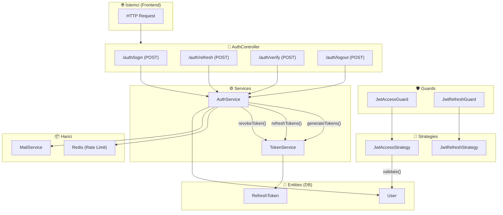
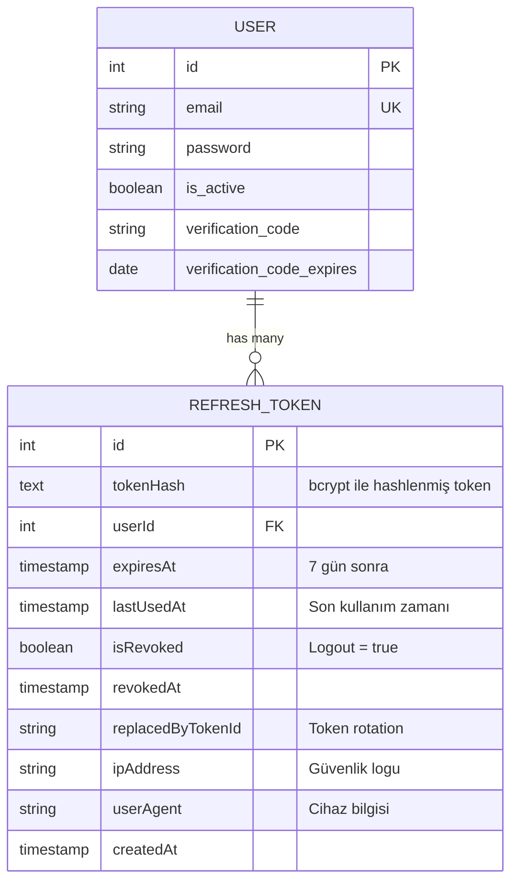
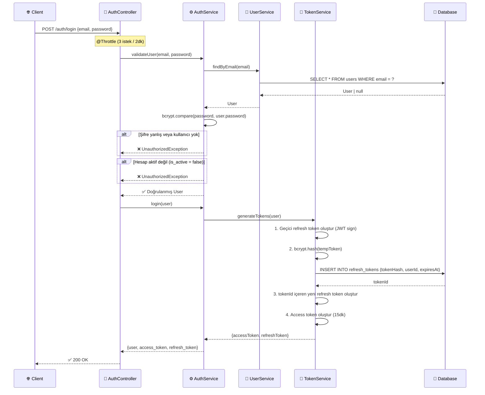
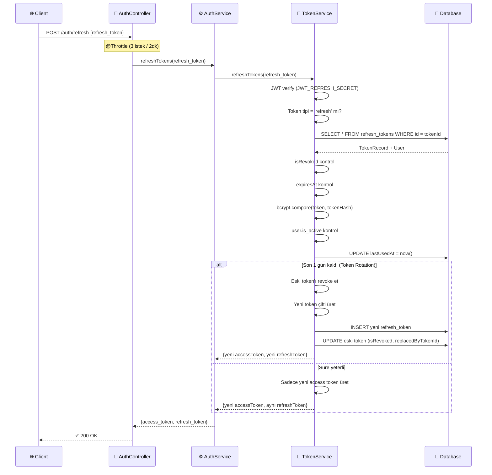
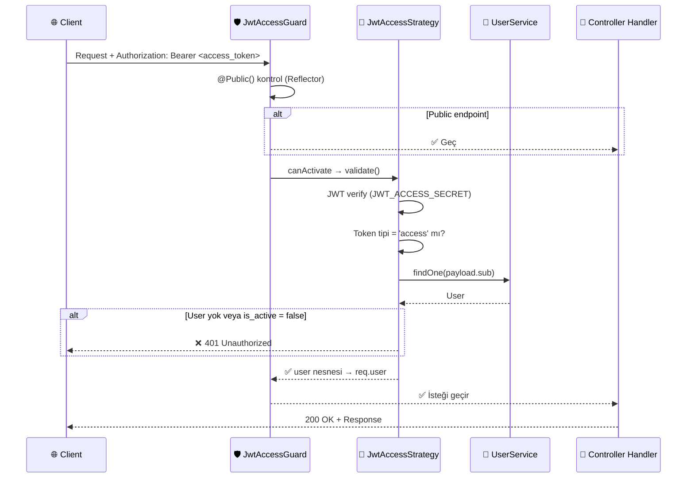
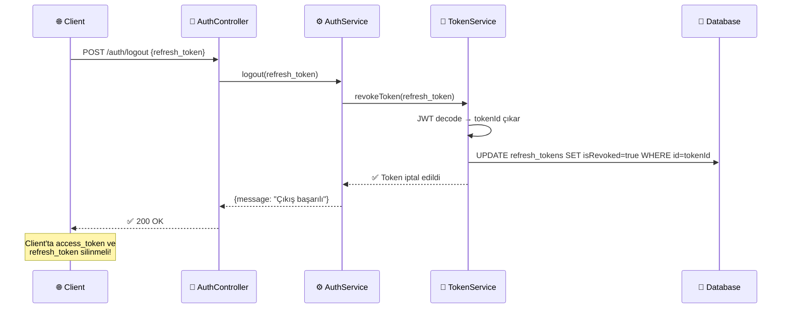

# 🔐 BahoTv Auth Mimarisi

## Genel Bakış

Auth modülü **Access Token + Refresh Token** mimarisini kullanır. Kısa ömürlü access token'lar (15dk) korumalı endpoint'lere erişim sağlarken, uzun ömürlü refresh token'lar (7 gün) yeni access token almak için kullanılır. Refresh token'lar **hashlenip veritabanında saklanır**.

---

## 🗂️ Dosya Yapısı

```
auth/
├── auth.module.ts              ← Modül tanımı, tüm bileşenleri birleştirir
├── auth.controller.ts          ← HTTP endpoint'leri (login/refresh/verify/logout)
├── auth.service.ts             ← Kullanıcı doğrulama & iş mantığı
├── token.service.ts            ← Token üretme, yenileme, iptal
├── entities/
│   └── refresh-token.entity.ts ← RefreshToken DB tablosu
├── guards/
│   ├── jwt-access.guard.ts     ← Access token koruması
│   └── jwt-refresh.guard.ts    ← Refresh token koruması
├── strategies/
│   ├── jwt-access.strategy.ts  ← Access token doğrulama stratejisi
│   └── jwt-refresh.strategy.ts ← Refresh token doğrulama stratejisi
└── dto/
    ├── login.dto.ts
    └── verify.dto.ts
```

---

## 🏗️ Bileşen Mimarisi



---

## 🗃️ Entity İlişkileri



> **ÖNEMLİ:** Refresh token **asla düz metin** olarak saklanmaz. `bcrypt.hash()` ile hashlenip `tokenHash` sütununa yazılır. Doğrulama sırasında `bcrypt.compare()` kullanılır.

---

## 🔄 Akış Diyagramları

### 1. Login Akışı



### 2. Token Yenileme (Refresh) Akışı



### 3. Korumalı Endpoint Erişimi (Guards & Strategies)



### 4. Logout Akışı



---

## 🧩 Bileşen Detayları

| Bileşen | Dosya | Rolü |
|---------|-------|------|
| **AuthController** | `auth.controller.ts` | 4 endpoint sunar: `login`, `refresh`, `verify`, `logout`. Rate limiting uygular |
| **AuthService** | `auth.service.ts` | Kullanıcı doğrulama, email verification, Redis ile deneme sayacı |
| **TokenService** | `token.service.ts` | Token CRUD: üretme, yenileme, iptal etme, temizleme |
| **JwtAccessGuard** | `guards/jwt-access.guard.ts` | `@Public()` decorator kontrol eder, erişim koruması sağlar |
| **JwtRefreshGuard** | `guards/jwt-refresh.guard.ts` | Refresh token koruması (body'den token alır) |
| **JwtAccessStrategy** | `strategies/jwt-access.strategy.ts` | Bearer header'dan access token doğrular, DB'den user çeker |
| **JwtRefreshStrategy** | `strategies/jwt-refresh.strategy.ts` | Body'deki refresh token'ı doğrular |
| **RefreshToken Entity** | `entities/refresh-token.entity.ts` | Token hash, expiry, revoke durumu, rotation takibi |
| **JwtPayload** | `interfaces/jwt-payload.interface.ts` | `{sub, email, type, tokenId?}` |
| **Tokens** | `interfaces/tokens.interface.ts` | `{accessToken, refreshToken}` |

---

## 🔒 Güvenlik Önlemleri

| Özellik | Uygulama |
|---------|----------|
| **Token Hashing** | Refresh token bcrypt ile hashlenip DB'ye kaydedilir |
| **Token Rotation** | Son 1 gün kalan refresh token otomatik yenilenir |
| **Rate Limiting** | `@Throttle` ile login, refresh, verify sınırlanır |
| **Timing Attack Koruması** | `validateUser()` kullanıcı bulunamazsa bile dummy hash ile compare yapar |
| **Token Revocation** | Logout'ta token DB'de revoke edilir, tekrar kullanılamaz |
| **Verification Brute Force** | Redis ile 5 yanlış denemede 10dk blok |
